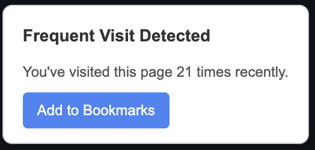

# Comeback History Chrome Extension

A Chrome extension that analyzes your browsing history and suggests frequently visited websites that you might want to bookmark. The extension helps you rediscover valuable sites and organize them into a dedicated "comeback" folder in your bookmarks bar.

## Motivation

Last time I updated my machine I just exported my bookmarks but didn't backup my browsing history. I lost a lot of useful links that I had visited multiple times but never bothered to bookmark. This extension is a solution to that problem, allowing you to easily find and bookmark frequently visited sites.

## Future Scope:
- **Automatic Bookmarking**: Add auto-mode, that will automatically bookmark the suggested sites.
- **User Interface Enhancements**: Improve the UI for better user experience.
- **Allow opening pages:**: Make links shown in the popup clickable, so you can open them directly from the popup.

---

## Features

- **Analyze Browsing History**: Automatically scans your browsing history to identify frequently visited websites.
- **Customizable Settings**: Adjust the lookback period and minimum visit count for suggestions.
- **Bookmark Suggestions**: Provides a list of websites you can easily add to your bookmarks.
- **Automatic Updates**: Re-analyzes your history daily to keep suggestions fresh.
- **Manual Analysis**: Trigger analysis on demand from the popup interface.
- **Inline Popup**: View suggestions directly on the current page without opening a separate popup.

---

## Installation

1. Clone this repository to your local machine:
   ```bash
   git clone https://github.com/eiselems/comeback-history-chrome.git
   ```
2. Open Chrome and navigate to `chrome://extensions/`.
3. Enable "Developer mode" in the top right corner.
4. Click on "Load unpacked" and select the cloned repository folder.
5. Make sure there is a 'comeback' folder inside your bookmark bar. If not, create one manually.
6. The extension should now be installed and active in your browser.

## Screenshots

### Popup / Settings Menu

### In-Page inline Popup
